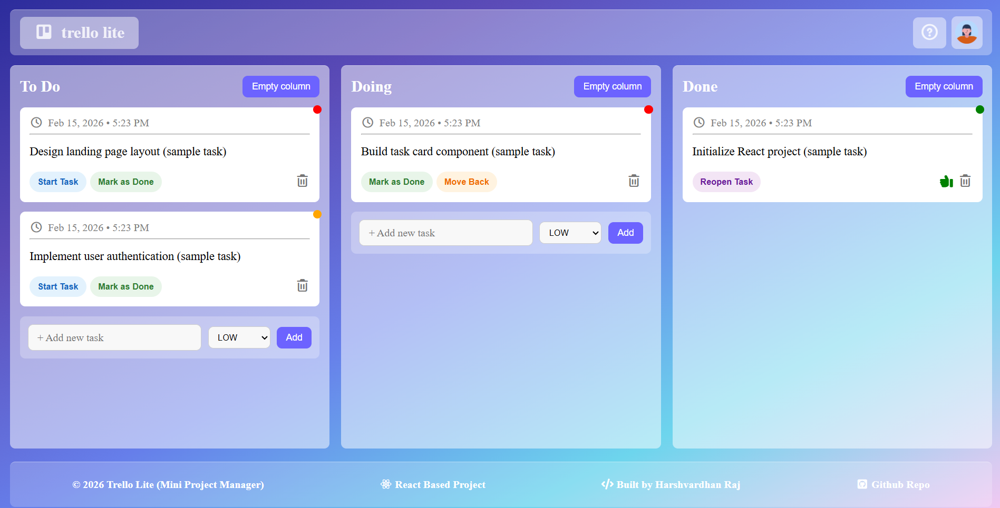
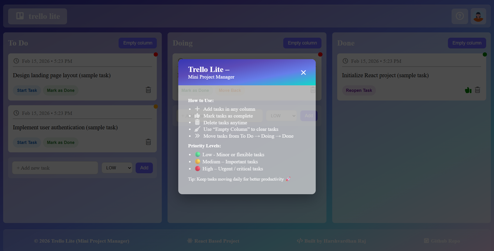

### 📌 Trello Lite – Mini Project Manager

A modern React-based mini project management application inspired by Trello.
This project allows users to manage tasks efficiently using a clean and interactive Kanban-style board.

### 🚀 Features

- ➕ Add tasks to columns

- 🔄 Move tasks between To Do, Doing, and Done

- 🗑 Delete individual tasks

- 🧹 Clear all tasks from a column

- 🎯 Priority levels (Low, Medium, High)

- 📅 Timestamp for task creation

- ✨ Clean UI with 3D card effects

- 📦 Fully built using React functional components & hooks

- 🛠 Tech Stack

- ⚛ React (Functional Components)

- 🎨 CSS3 (Custom Styling + Glassmorphism)

- 🧠 useState Hook for State Management

- 📦 JavaScript (ES6+)

### 🎮 How It Works

- Add a task in any column.

- Move tasks forward as work progresses.

- Mark tasks as completed.

- Delete tasks if no longer needed.

- Use Empty Column to clear all tasks at once.

- 🎨 Priority Levels

- 🟢 Low – Minor or flexible tasks

- 🟡 Medium – Important tasks

- 🔴 High – Urgent or critical tasks

### 🖥 Installation & Setup

- Clone the repository:

- git clone https://github.com/YOUR_USERNAME/trello-lite.git

### Install dependencies:

npm install

### 📌 Future Improvements

- 🔄 Drag & Drop functionality

- 💾 Local Storage persistence

- 🌙 Dark mode

- 🔐 Authentication

- 🌐 Backend integration

### 👨‍💻 Author

Harshvardhan Raj
React-based Mini Project Manager

### ⭐ If You Like This Project

Give it a ⭐ on GitHub and feel free to fork & improve it!

### Screenshots of trello lite

